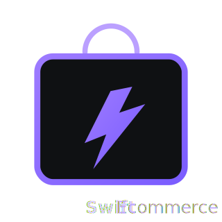

# SwiftE-commerce



## 🌟 What is SwiftE-commerce?

SwiftE-commerce is an enterprise-grade **AI-powered e-commerce platform** engineered for scale. It leverages a **Polyglot Microservices Architecture**, combining the strict type safety of **TypeScript (NestJS)** for core business logic with the data processing power of **Python** for Machine Learning.

It features a fully decoupled design where high-latency tasks (Analytics, ML Inference) are offloaded to specialized microservices via **RabbitMQ**, ensuring a buttery-smooth user experience on the **React** frontend.

## 🏗️ System Architecture

The platform is organized into a monorepo with four distinct applications:

| Service | Tech Stack | Responsibility |
| :--- | :--- | :--- |
| **Frontend** | React, Vite, Tailwind | Customer storefront & Admin dashboard |
| **Backend (Monolith)** | NestJS, PostgreSQL | API Gateway, Auth, Product/Order Management |
| **Analytics Service** | NestJS, TypeORM | High-volume data ingestion, aggregation & reporting |
| **AI Engine** | Python, FastAPI | Demand forecasting & ML inference |

**Infrastructure:** RabbitMQ (Event Bus), Redis (Caching/Queues), PostgreSQL (Primary DB).

## 🚀 Key Features

### **Frontend Experience (React)**
- ⚛️ **Modern Stack**: Built with **Vite**, **React 18**, and **TypeScript**.
- 🎨 **UI Library**: Beautiful, accessible components using **Tailwind CSS** and **Shadcn UI**.
- ⚡ **State Management**: Scalable state handling with **Redux Toolkit** and **React Query**.
- 📱 **Responsive**: Mobile-first design for both Storefront and Admin Panel.
- 🛍️ **Smart Cart**: Persistent cart state and optimized checkout flow.

### **Core Backend (NestJS)**
- 🔐 **Security**: Role-Based Access Control (RBAC) with JWT & Refresh Tokens.
- 📦 **Inventory System**: ACID-compliant order processing with optimistic locking.
- 📨 **Event-Driven**: Async email notifications and webhooks via RabbitMQ.
- 🧩 **Modular Design**: Domain-Driven Design (DDD) principles applied to modules.

### **Analytics Microservice (NestJS)**
- 📊 **Heavy Compute Offloading**: Calculates complex aggregations (Revenue, Conversion Rates) without blocking the main API.
- 🐇 **RabbitMQ Consumer**: Processes `track_event` messages asynchronously.
- 📈 **Timeseries Data**: Optimized storage patterns for daily/monthly stats.

### **AI-Powered Features (Python)**
- 🤖 **Stock Prediction**: LightGBM & TensorFlow models predict stockouts 14 days in advance.
- 📝 **Content Generation**: Hugging Face integration for auto-generating product descriptions.
- 🧠 **Dynamic Pricing**: (Coming Soon) ML-based price optimization.

## 🛠️ Technology Stack

### **Frontend**
* **Framework**: React 18
* **Build Tool**: Vite
* **Styling**: Tailwind CSS, CSS Modules
* **State**: Redux Toolkit, TanStack Query
* **Forms**: React Hook Form + Zod

### **Backend & Microservices**
* **Runtime**: Node.js 18+
* **Framework**: NestJS (Monolith & Microservice)
* **Language**: TypeScript
* **Transport**: RabbitMQ (AMQP), HTTP (REST)
* **ORM**: TypeORM
* **Validation**: class-validator, class-transformer

### **Data & ML**
* **Language**: Python 3.10+
* **Libraries**: Pandas, NumPy, Scikit-learn
* **Models**: LightGBM, TensorFlow
* **Database**: PostgreSQL 15+
* **Cache**: Redis 7+

## 🚀 Quick Start

### Prerequisites
- Node.js 18+ & npm
- Python 3.10+
- Docker & Docker Compose

### 1. Installation
Clone the repository and install dependencies for all services:

```bash
git clone [https://github.com/akaeyuhi/SwiftE-commerce.git](https://github.com/akaeyuhi/SwiftE-commerce.git)
cd SwiftE-commerce

# Install Backend Deps
cd backend && npm install

# Install Frontend Deps
cd ../swiftecommerce-frontend && npm install

# Install Analytics Microservice Deps
cd ../analytics-microservice && npm install

# Install Python Deps
cd ../predictor && pip install -r requirements.txt
